### Hi there 👋 I'm Abdullah

- 🔭 I’m currently working as a Data Scientist II at Rayn Group.
- 📚 I was the first ever student to graduate from FAST-NUCES in 7 semesters with extra credits.
- 💬 Feel free to hit me up for anything, I'm happy to help you out.
- 📫 How to contact me: abdullahbilal64@gmail.com
- ⚡ Fun fact: A cloud weighs around a million tonnes.
 
 
 

## 🧑‍💻 Tech Stack

 Github Stats:

<!--
**abdullahbilal64/abdullahbilal64** is a ✨ _special_ ✨ repository because its `README.md` (this file) appears on your GitHub profile.

Here are some ideas to get you started:

- 🔭 I’m currently working on ...
- 🌱 I’m currently learning ...
- 👯 I’m looking to collaborate on ...
- 🤔 I’m looking for help with ...
- 💬 Ask me about ...
- 📫 How to reach me: ...
- 😄 Pronouns: ...
- ⚡ Fun fact: A cloud weighs around a million tonnes.
-->
